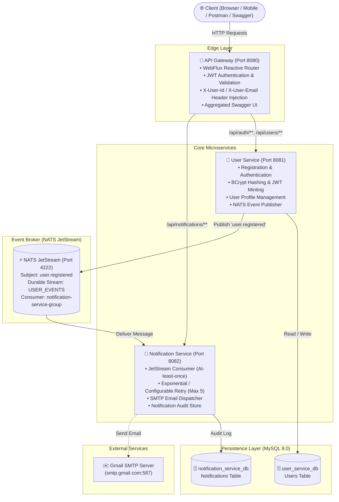
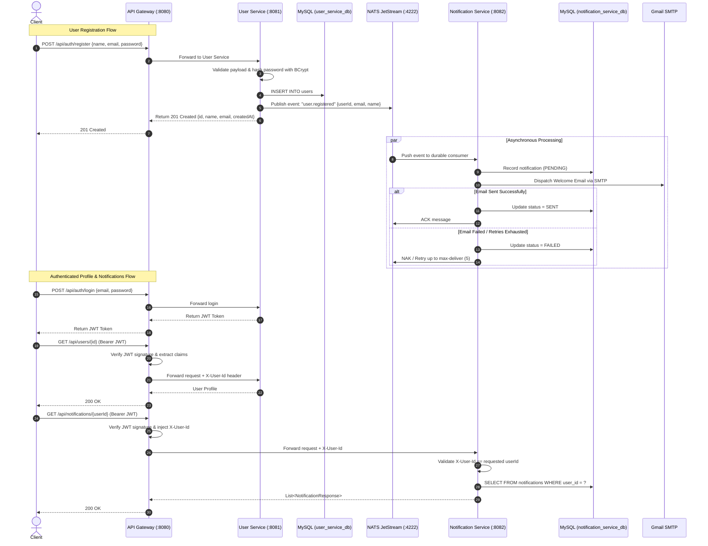

# Event-Driven Microservices Architecture Platform

[](https://openjdk.org/)
[](https://spring.io/projects/spring-boot)
[](https://spring.io/projects/spring-cloud-gateway)
[](https://nats.io/)
[](https://www.mysql.com/)
[](https://swagger.io/)
[](https://www.docker.com/)

A production-ready, distributed, event-driven microservices system demonstrating modern architectural patterns: **API Gateway Pattern**, **Database-per-Service Pattern**, **Asynchronous Event-Driven Messaging with NATS JetStream**, **Stateless JWT Authentication & Claim Propagation**, and **Interactive OpenAPI 3.0 / Swagger Documentation**.

---

## 📑 Table of Contents
1. [Architecture Overview](#-architecture-overview)
2. [Event-Driven Flow Diagram](#-event-driven-flow-diagram)
3. [Microservices Breakdown](#-microservices-breakdown)
4. [Interactive Swagger Documentation](#-interactive-swagger-documentation)
5. [Technology Stack](#-technology-stack)
6. [Getting Started & Docker Compose](#-getting-started--docker-compose)
7. [End-to-End API Walkthrough](#-end-to-end-api-walkthrough)
8. [Architecture Patterns & Interview Highlights](#-architecture-patterns--interview-highlights)
9. [Troubleshooting & Verification](#-troubleshooting--verification)

---

## 🏛 Architecture Overview



---

## 🔄 Event-Driven Flow Diagram



---

## 🧩 Microservices Breakdown

| Service | Port | Technology | Key Responsibilities |
| :--- | :---: | :--- | :--- |
| **API Gateway** | `8080` | Spring Cloud Gateway (WebFlux) | Single entry point, path routing, JWT validation filter, claim injection (`X-User-Id`, `X-User-Email`), Aggregated Swagger UI |
| **User Service** | `8081` | Spring Boot 4.1.1, Spring Data JPA, Spring Security | User registration, password hashing (BCrypt), JWT minting, profile retrieval/update, NATS event publishing |
| **Notification Service** | `8082` | Spring Boot 4.1.1, Spring Data JPA, Spring Mail | At-least-once JetStream consumer, email delivery with retry, notification audit persistence |
| **NATS Broker** | `4222` / `8222` | NATS JetStream 2.10 | High-performance durable event streaming and pub/sub |
| **Database** | `3307` (ext) / `3306` (int) | MySQL 8.0 | Isolated schemas: `user_service_db` and `notification_service_db` |

---

## 📖 Interactive Swagger Documentation

Swagger 3.0 / OpenAPI documentation is integrated across all services with **Bearer JWT Authentication** support.

### 🌟 1. Centralized Aggregated Gateway Swagger UI (Recommended)
Access the unified API documentation through the API Gateway, where you can inspect all services from a single dropdown:
- **URL**: [http://localhost:8080/swagger-ui.html](http://localhost:8080/swagger-ui.html)
- **Features**:
  - Switch between **User Service** and **Notification Service** specs in the top-right dropdown.
  - Test live API calls directly routed through the Gateway.
  - Click **Authorize** to paste a JWT token and test protected endpoints.

### 2. Standalone Service Swagger UIs
- **User Service Swagger UI**: [http://localhost:8081/swagger-ui/index.html](http://localhost:8081/swagger-ui/index.html)
- **Notification Service Swagger UI**: [http://localhost:8082/swagger-ui/index.html](http://localhost:8082/swagger-ui/index.html)

### 3. Raw OpenAPI 3.0 JSON Specs
- **User Service via Gateway**: `GET http://localhost:8080/user-service/v3/api-docs`
- **Notification Service via Gateway**: `GET http://localhost:8080/notification-service/v3/api-docs`

---

## 🛠 Technology Stack

- **Runtime**: Java 21 LTS
- **Framework**: Spring Boot 4.1.1 (Spring 7.x ecosystem)
- **Gateway**: Spring Cloud Gateway Server WebFlux 2025.1.3
- **Security**: Spring Security, JJWT (`io.jsonwebtoken:jjwt-api:0.12.6`), BCrypt Password Encoder
- **Event Streaming**: NATS JetStream (`io.nats:jnats:2.20.4`)
- **Documentation**: Springdoc OpenAPI 3.0 (`org.springdoc:springdoc-openapi-starter-webmvc-ui:3.0.0` & `webflux-ui:3.0.0`)
- **Database**: MySQL 8.0 with Spring Data JPA / Hibernate
- **Build Tool**: Gradle 9.7.1
- **Containerization**: Docker & Docker Compose (multi-stage Gradle build images)

---

## 🚀 Getting Started & Docker Compose

### Prerequisites
- [Docker Desktop](https://www.docker.com/products/docker-desktop) installed and running
- Ports available: `8080` (Gateway), `8081` (User Service), `8082` (Notification Service), `4222` (NATS), `3307` (MySQL)

### 1. Environment Configuration
The `.env` file in the root directory holds all service configurations:

```env
# MySQL credentials
MYSQL_ROOT_PASSWORD=your_root_password
DB_USERNAME=root
DB_PASSWORD=your_root_password

# JWT Shared Secret (Must be identical in user-service and api-gateway)
JWT_SECRET=W2hU2g2d1hvV0VwbVp6Vk5yUW1ld3pYUG1YMWp1U1o

# Gmail SMTP Configuration for Notification Service
GMAIL_USERNAME=your-email@gmail.com
GMAIL_APP_PASSWORD=your-16-char-app-password
```

### 2. Start the Entire Platform
Run the following command in the project root:

```bash
docker compose up --build -d
```

### 3. Check Service Health
```bash
docker compose ps
```

All 5 services (`mysql`, `nats`, `user-service`, `notification-service`, `api-gateway`) will start up with configured health checks and dependencies.

---

## 🧪 End-to-End API Walkthrough

### 1. Register a New User
Registers a user in `user-service`, hashes the password, and asynchronously emits a `user.registered` event over NATS.

```bash
curl -X POST http://localhost:8080/api/auth/register \
  -H "Content-Type: application/json" \
  -d '{
    "name": "Alice Developer",
    "email": "alice@example.com",
    "password": "SecurePassword123!"
  }'
```

**Expected Response (HTTP 201 Created):**
```json
{
  "id": "c3e9811c-d102-4c2f-b49e-131754024345",
  "name": "Alice Developer",
  "email": "alice@example.com",
  "createdAt": "2026-09-10T02:00:00Z"
}
```

*Behind the scenes*: `notification-service` consumes this event from NATS JetStream, attempts email dispatch, and creates a notification record in `notification_service_db`.

---

### 2. Login & Obtain JWT Token
Validates credentials against BCrypt hash and issues a signed JWT token.

```bash
curl -X POST http://localhost:8080/api/auth/login \
  -H "Content-Type: application/json" \
  -d '{
    "email": "alice@example.com",
    "password": "SecurePassword123!"
  }'
```

**Expected Response (HTTP 200 OK):**
```json
{
  "token": "eyJhbGciOiJIUzI1NiIsInR5cCI6IkpXVCJ9.eyJzdWIiOiJjM2U5ODExYy1kMTAyLTRjMmYtYjQ5ZS0xMzE3NTQwMjQzNDUiLCJlbWFpbCI6ImFsaWNlQGV4YW1wbGUuY29tIiwiZXhwIjoxNzU3NDcwNDAwfQ...",
  "user": {
    "id": "c3e9811c-d102-4c2f-b49e-131754024345",
    "name": "Alice Developer",
    "email": "alice@example.com",
    "createdAt": "2026-09-10T02:00:00Z"
  }
}
```

> **Save the token**: Set as an environment variable:
> ```bash
> TOKEN="<token_from_login>"
> USER_ID="c3e9811c-d102-4c2f-b49e-131754024345"
> ```

---

### 3. Get User Profile (Protected Route)
The API Gateway verifies the JWT, injects `X-User-Id`, and routes to `user-service`. The service verifies that the requester matches the requested resource.

```bash
curl -X GET http://localhost:8080/api/users/$USER_ID \
  -H "Authorization: Bearer $TOKEN"
```

**Expected Response (HTTP 200 OK):**
```json
{
  "id": "c3e9811c-d102-4c2f-b49e-131754024345",
  "name": "Alice Developer",
  "email": "alice@example.com",
  "createdAt": "2026-09-10T02:00:00Z"
}
```

---

### 4. Update User Profile
```bash
curl -X PUT http://localhost:8080/api/users/$USER_ID \
  -H "Authorization: Bearer $TOKEN" \
  -H "Content-Type: application/json" \
  -d '{
    "name": "Alice Senior Engineer",
    "email": "alice.senior@example.com"
  }'
```

**Expected Response (HTTP 200 OK):**
```json
{
  "id": "c3e9811c-d102-4c2f-b49e-131754024345",
  "name": "Alice Senior Engineer",
  "email": "alice.senior@example.com",
  "createdAt": "2026-09-10T02:00:00Z"
}
```

---

### 5. View Notification Audit History
Queries `notification-service` through the Gateway to verify the welcome notification triggered by NATS.

```bash
curl -X GET http://localhost:8080/api/notifications/$USER_ID \
  -H "Authorization: Bearer $TOKEN"
```

**Expected Response (HTTP 200 OK):**
```json
[
  {
    "id": "6d1dfd9a-58ef-4ee6-857e-0be2a09f87c9",
    "eventType": "user.registered",
    "message": "Welcome to our platform, Alice Developer!",
    "status": "SENT",
    "sentAt": "2026-09-10T02:00:01Z"
  }
]
```

---

### 6. Security & Edge Case Tests

| Test Scenario | Request | Expected Status | Description |
| :--- | :--- | :---: | :--- |
| **Missing Token** | `GET /api/users/{id}` without Authorization header | `401 Unauthorized` | Rejected immediately at API Gateway |
| **Invalid Token** | `GET /api/users/{id}` with forged/expired token | `401 Unauthorized` | Rejected by Gateway JWT signature verification |
| **Access Other User** | `GET /api/users/{otherId}` with valid token | `403 Forbidden` | Resource owner authorization violation |
| **Duplicate Email** | `POST /api/auth/register` with existing email | `409 Conflict` | Unique constraint protection |
| **Validation Error** | `POST /api/auth/register` with invalid email | `400 Bad Request` | Jakarta Bean Validation failure |

---

## 🎯 Architecture Patterns & Interview Highlights

### 1. API Gateway Pattern & Token Propagation
- **Edge Security**: `api-gateway` acts as a reverse proxy running Spring Cloud Gateway (non-blocking WebFlux).
- **Decoupled Verification**: The Gateway validates the JWT signature, decodes claims (`userId`, `email`), and injects standard internal headers (`X-User-Id`, `X-User-Email`) downstream.
- Downstream services remain protected and can trust verified headers while maintaining independence.

### 2. Asynchronous Decoupling via NATS JetStream
- **High Throughput**: User registration does not block waiting for SMTP delivery (which can take 1-3 seconds or fail due to network instability).
- **At-Least-Once Delivery**: NATS JetStream durable stream stores events and guarantees delivery even if `notification-service` is temporarily down.
- **Consumer Group**: JetStream consumer groups ensure horizontally scaled notification workers share the load without duplicate processing.

### 3. Resiliency & Retry Policy
- `notification-service` implements configurable retry logic (`notification.max-deliver=5`).
- Failed attempts are recorded in the notification database with reason codes before exhaustion or Dead Letter Queue (DLQ) handling.

### 4. Database-per-Service Isolation
- `user-service` and `notification-service` have completely separate logical databases (`user_service_db`, `notification_service_db`).
- No cross-database joins or shared tables; all communication occurs via APIs or events.

---

## 🔍 Verification & Docker Commands

### Stopping Containers
```bash
docker compose down
```

### Inspecting Logs
```bash
docker compose logs -f user-service
docker compose logs -f notification-service
docker compose logs -f api-gateway
```

### Resetting Databases
```bash
docker compose down -v
docker compose up --build -d
```
